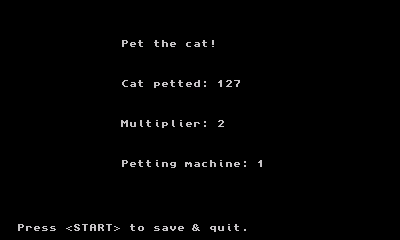
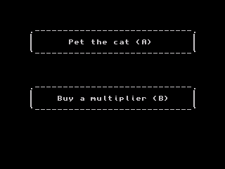

# Pet the cat! for Nintendo 3DS

A 3DS game that lets you pet cats.  
This is Cookie clicker like game, but with cats.  

Powered by [ctru-rs](https://github.com/rust3ds/ctru-rs)!

WARNING: The 3D mode is a little bit junky, that can cause eye strain and epilepsy!

## Screenshots




## Building

You need to follow this [guide](https://github.com/rust3ds/ctru-rs/blob/master/ctru-rs/README.md).

Then you can build the game with:
```cmd
cargo 3ds run -a [3DS IP address, like: 192.168.1.10]
```
`-a` is optional, if you want to run on physical 3DS with homebrew launcher.
3dsLink is available on Homebrew Launcher by pressing `Y` button.